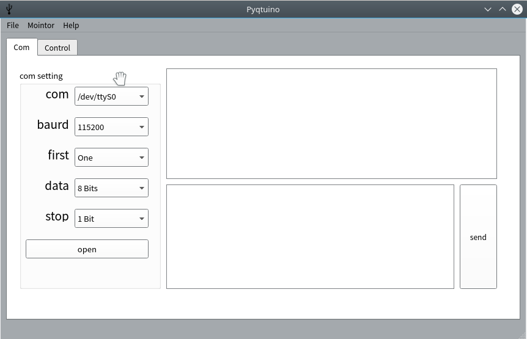

Pyquino
===

python3 + PyQt5 + Arduino

A Gui-Base tools with pyserial and PyQt5 for communcation to machine.

and will control the simulation of Vrep.

How to use it ?
---

Open GUI by Python:

<pre>
$pip3 install requirements.txt 

$python3 launchPyquino.py

</pre>

The vrep option is for specific machine control system on the  simulation of Vrep.

The .ttt file will update Recently

Power By
---

Made by [PyQt 5.7](http://doc.qt.io/qt-5/index.html) and [Eric 6.18](http://eric-ide.python-projects.org/).

This tool is not complete.

